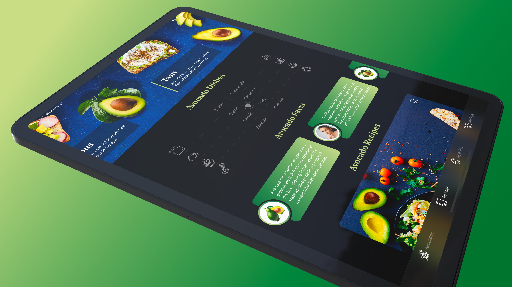

# Avocados - recipe app build with SwiftUI

Recipe app build with Swift, SwiftUI for iOS 14

### Features:

- Custom Loading screen
  
- Themes support for light and dark modes
  
- Micro animations
  
- TabView navigation
  
- iPad support
  

